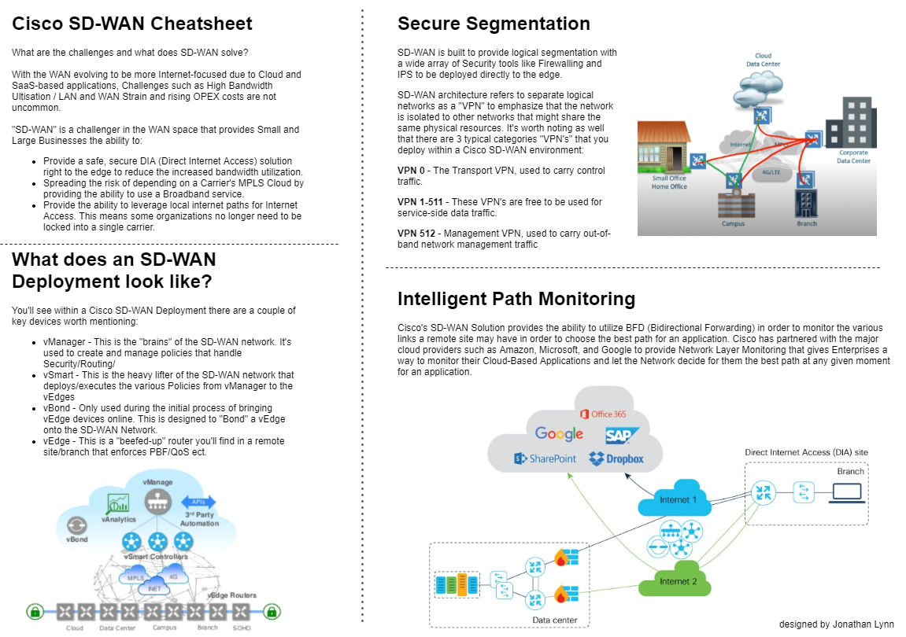

# Thanks for Visiting.
* * *

### Blog Posts

* [2021 Jul - BGP - Return Update Packets?](./assets/blogposts/2021-JUL-BGP-returnupdatepackets.html)
* [2021 Jul - BGP Deep Dive - Best Path Selection Critiera](./blog-2021-BGP-part1)
* [2021 Mar - Your Automation Journey Can Start Anywhere](./blog-2021-startyourautomationjourney.html)
* [2020 Oct - Testing and Monitoring my new Carrier Links](./blog-2021-remoteofficelinktesting.html)

### Videos

coming soon!

### CheatSheets

* [IS-IS Cheatsheet](./assets/cheatsheet-isis.png)
* [Cisco Viptela SD-WAN Cheatsheet](./assets/sdwan-1.png)

* BGP CheatSheet (coming soon!)

### Publications

* Palo Alto PAN-OS CLI Guide (coming soon!)

* * *
